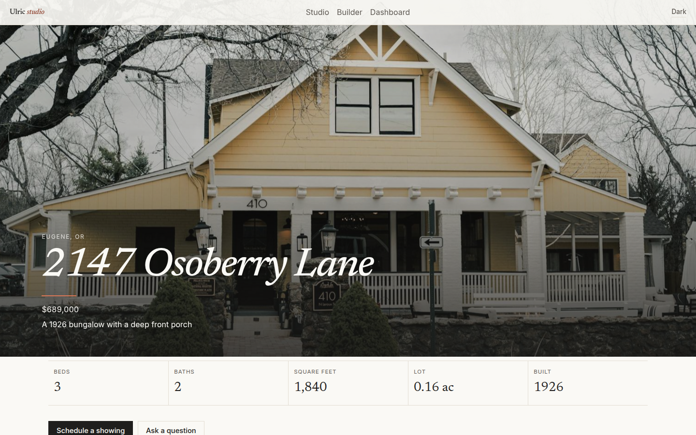

# Ulric Listing Studio

Ulric studio builds a website for one house.



## Features

- A multi-step builder for the address, price, beds, baths, square feet, lot, year built, description, features and amenities, photos, open houses, showing windows, and agent details.
- A live preview beside the form, and three page themes: Alder, Hearth, and Linen.
- A public page at `/p/<slug>` with a full-bleed hero, a gallery lightbox, key facts, a Leaflet map, a neighborhood note, and a mortgage calculator with a payment chart.
- Open Graph tags on the public page when the API serves the built app.
- A lead form. Leads are stored for the dashboard. The notifier only writes a log line. No email is sent.
- Showing windows. A visitor picks a slot. The same slot cannot be booked twice. A booked showing can be downloaded as an `.ics` file.
- A dashboard with listings, lead status (`new`, `contacted`, `showing`, `offer`), an upcoming showings calendar, and view and lead counts.
- Light and dark mode. The choice is saved in the browser. With no saved choice, the page follows the system setting.
- Phone and desktop layouts, keyboard focus, and reduced motion support.

## Stack

- ASP.NET Core 8 Web API
- Angular 22 with standalone components and signals
- SQLite and EF Core
- Leaflet with OpenStreetMap tiles
- Nominatim for geocoding, called from the API, cached in SQLite, and limited to one request at a time
- Chart.js for the payment breakdown
- QuestPDF, Community license, for the one-page flyer

## Run with Docker

```bash
docker compose up --build
```

Open http://localhost:8080

The first start seeds 1847 Alder Lane in Cedarwick, a fictional town. The database and uploads live in the `ulric-data` volume.

## Run the API and the Angular app

API:

```bash
dotnet run --project src/Ulric.Api --urls http://localhost:5080
```

Angular, in another terminal:

```bash
cd src/Ulric.Web
npm ci
npm start
```

Open http://localhost:4200. The dev server proxies `/api` and `/uploads` to port 5080.

Tests:

```bash
dotnet test Ulric.sln
```

## Environment variables

ASP.NET Core reads these names from the environment. `.env.example` lists the same names. The app does not load a `.env` file by itself.

| Name | Purpose | Default |
| --- | --- | --- |
| `ConnectionStrings__Ulric` | SQLite file | `Data Source=ulric.db` |
| `Storage__Root` | Folder for uploaded images | `App_Data/uploads` |
| `Geocoding__Enabled` | Turn Nominatim on or off | `true` |
| `Geocoding__UserAgent` | User-Agent sent to Nominatim | `UlricListingStudio/1.0 (+https://github.com/erichers/ulric-listing-studio)` |
| `Geocoding__BaseUrl` | Nominatim search host | `https://nominatim.openstreetmap.org` |
| `Geocoding__MinIntervalMs` | Minimum gap between Nominatim calls | `1100` |
| `Notifier__Mode` | Lead notifier. `log` is the only built-in mode. | `log` |
| `Cors__Origins__0` | Browser origin allowed to call the API | `http://localhost:4200` |
| `ASPNETCORE_URLS` | Bind address | `http://localhost:5080` in development, `http://0.0.0.0:8080` in Docker |
| `ASPNETCORE_ENVIRONMENT` | `Development` or `Production` | `Development` |
| `PublicBaseUrl` | Reserved. Open Graph uses the request host. | empty |

`src/Ulric.Api/appsettings.json` holds the same defaults. Copy `src/Ulric.Api/appsettings.Development.example.json` over `appsettings.Development.json` when you want local overrides. Do not commit secrets. This app has no API keys.

## Architecture

The Angular app is the studio (home, builder, dashboard) and the public listing page. The API stores listings, photos, open houses, showing windows, bookings, and leads in one SQLite file.

Slug generation, mortgage math, and showing-slot conflicts live in `src/Ulric.Api/Services`. xUnit covers those three.

Nominatim is called only when an address changes and the cache has no row for that query. Hits and misses are stored in `GeocodeCache`. The server waits at least 1.1 seconds between calls and sends a descriptive User-Agent. The demo listing ships with a stand-in coordinate so the map works without a network call. Cedarwick is not a real town. The neighborhood text on the page says so.

`ILeadNotifier` is the plug-in point for lead delivery. `LoggingLeadNotifier` is registered by default. It writes an information log and does not send email, SMS, or any other message.

In Docker, the API serves the built Angular files. A request for `/p/<slug>` gets `index.html` with the listing title, description, and image filled in. `ng serve` sets the same tags in the browser after the listing loads.

There is no login. This is a local studio demo. Do not put it on the public internet without adding authentication.

Screenshots of the builder, the public page, and the dashboard, in light and dark mode at desktop and phone width, are in `docs/screenshots/`.

## Photographs

The demo listing uses Unsplash photos under the [Unsplash License](https://unsplash.com/license).

- Front porch: [Karina G](https://unsplash.com/photos/O4G2VR9Leb0)
- Street view: [Ian MacDonald](https://unsplash.com/photos/-dcznEJPmsk)
- Front door: [Amanda Smith](https://unsplash.com/photos/_lfGDMDIJq0)
- Side windows: [Amadeus Moga](https://unsplash.com/photos/UquwsJuETQk)
- Maples down the block: [Benjamin Disinger](https://unsplash.com/photos/rhZR99w1byQ)
- Agent headshot: [Christina @ wocintechchat.com](https://unsplash.com/photos/0Zx1bDv5BNY)

## License

MIT. See `LICENSE`.

QuestPDF is used under the QuestPDF Community license.
