# Ulric Listing Studio

Ulric studio builds a website for one house. The demo is one listing, 418 Larkspur Way in Fernhollow, a fictional town. The address, town, price and facts are fictional, the agent is made up, and the photographs are free CC0 / public-domain stock interiors.


## What it does

- A multi-step builder for the address, price, beds, baths, square feet, lot, year built, description, neighborhood, schools, parks, features, photos, open houses, showing windows, and agent details.
- A live preview beside the form, and three page themes: Alder, Hearth, and Linen.
- A public page at `/p/<slug>` laid out like a big listing site: a photo gallery (a large cover plus a grid on desktop, a swipeable strip on phones) with a full-screen lightbox, price and key facts, the description, grouped features and facts, a 3D daylight model you can explore, a Leaflet map, neighborhood notes, a mortgage calculator with a payment chart, showing times, and a sticky agent card.
- Open Graph tags on the public page when the API serves the built app.
- A lead form. Leads are stored for the dashboard. The notifier only writes a log line. No email is sent.
- Showing windows. A visitor picks a slot. The same slot cannot be booked twice. A booked showing can be downloaded as an `.ics` file.
- A dashboard with listings, lead status (`new`, `contacted`, `showing`, `offer`), an upcoming showings calendar, and view and lead counts.
- Light and dark mode. The choice is saved in the browser. With no saved choice, the page follows the system setting.
- Motion on entrances, numbers, the daylight study, and route changes. `prefers-reduced-motion` turns that motion off.
- Phone and desktop layouts, keyboard focus, and skeleton placeholders while data loads.

## Screenshot tour

Light desktop, then dark desktop, then the phone widths.

| Screen | Light desktop | Dark desktop | Light phone | Dark phone |
| --- | --- | --- | --- | --- |
| Studio | 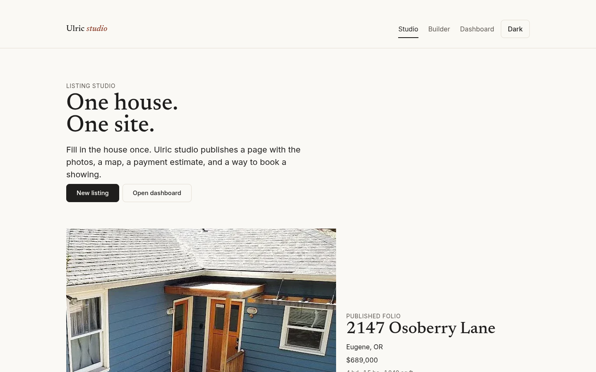 | 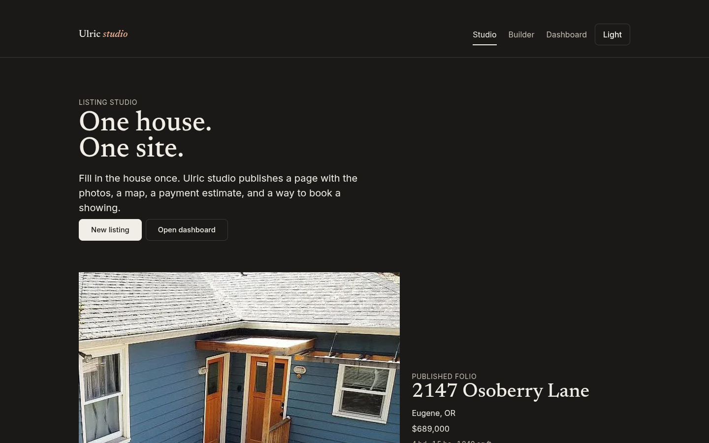 | 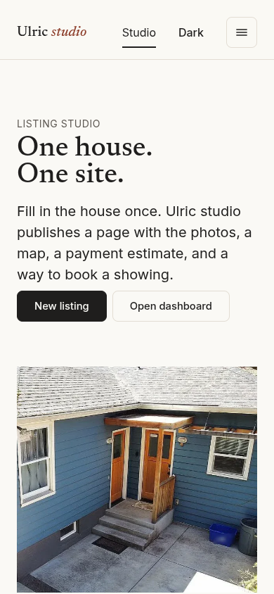 | 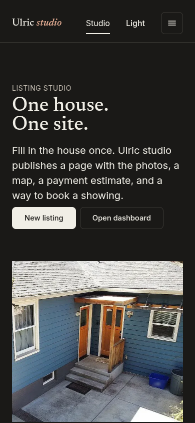 |
| Listing page |  | 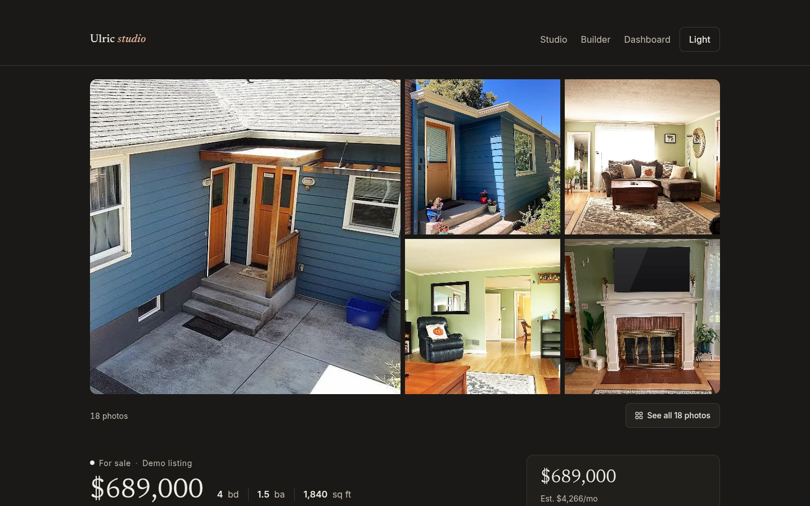 | 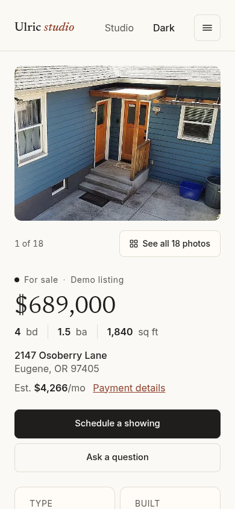 | 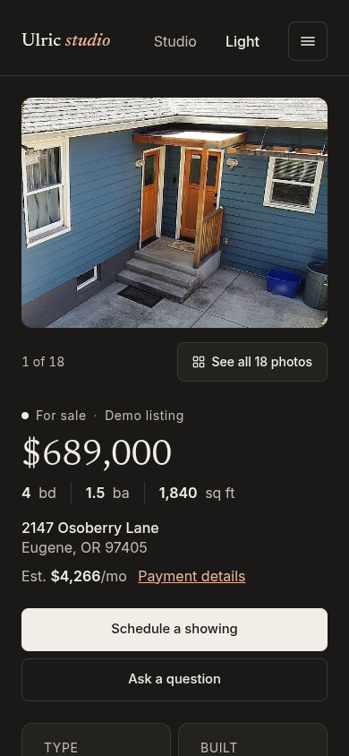 |
| Builder | 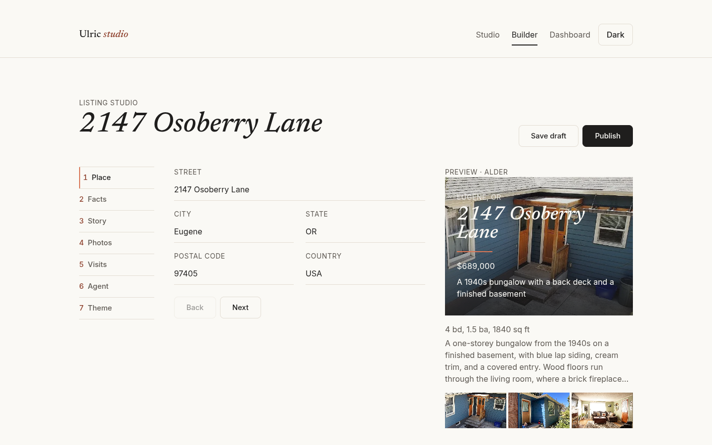 | 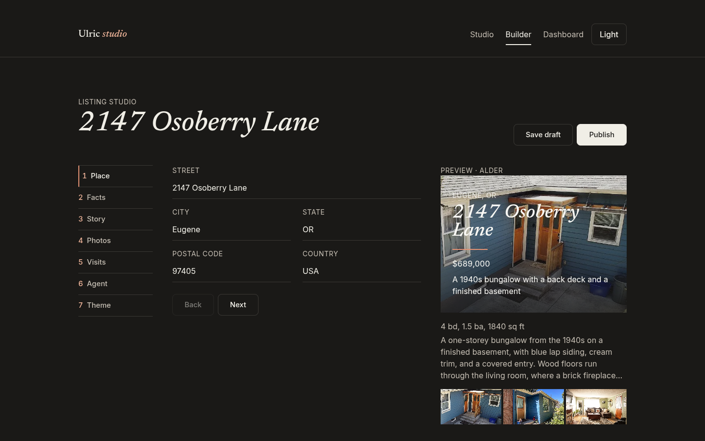 | 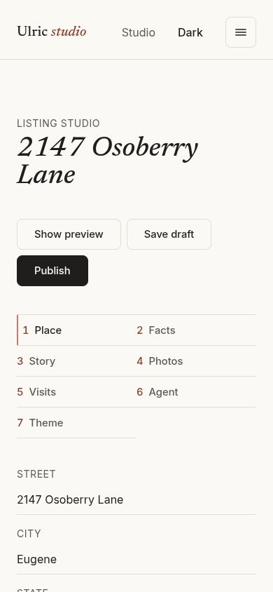 | 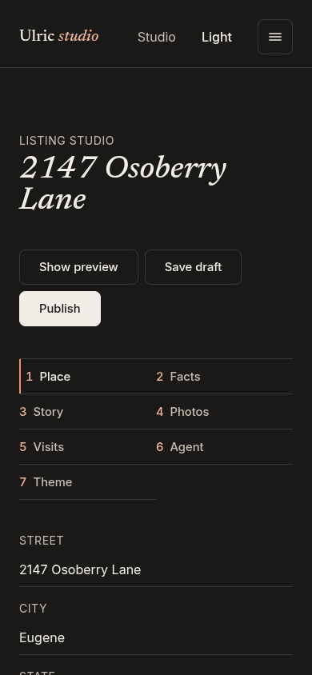 |
| Dashboard | 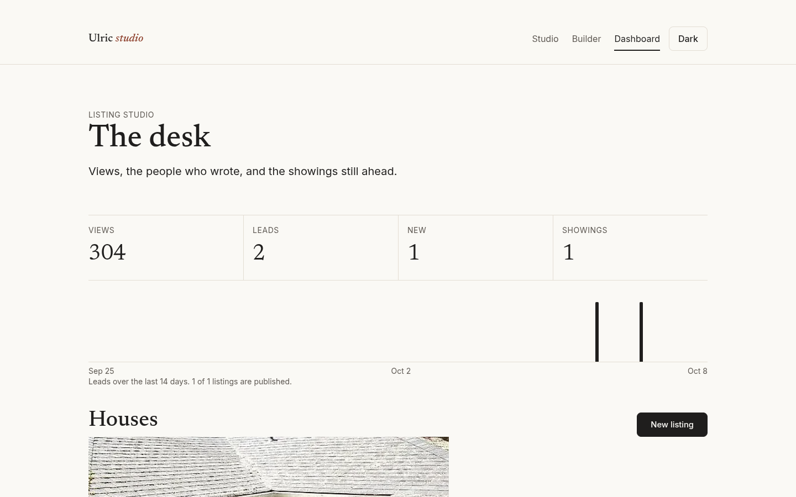 | 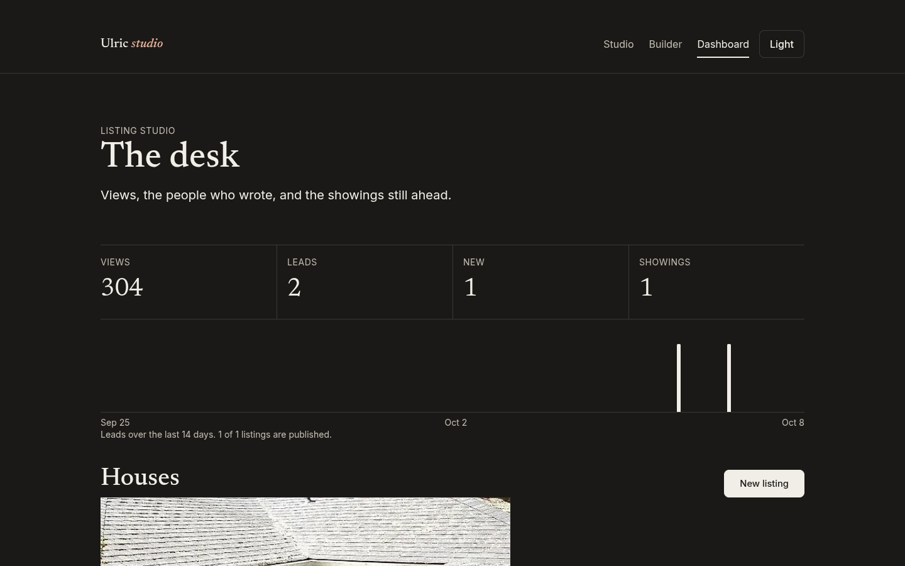 | 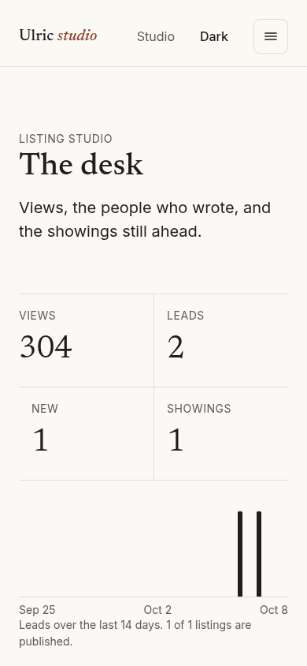 | 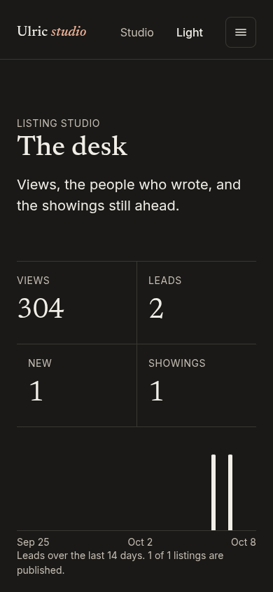 |

## Motion

Pages enter with a short fade and a 12px rise, staggered when a section has several parts. Route changes crossfade. Counts on the desk and the monthly payment run up once they are on screen. The 14-day lead chart is about 150px tall: thin columns with a small rounded top, a faint baseline, and 12px labels. Days with no leads stay empty, the columns grow up from the baseline, and a hover shows the date and count.

The listing page also has a daylight study. The demo house is a procedural three.js model of a one-storey 1940s bungalow on a finished basement, drawn from a reference design: blue lap siding with cream trim, a low hip roof, a small gabled entry with a cedar door, a brick chimney, a carport, and a back deck with a shade sail over a brick patio. Inside, the main floor has: living room with the brick fireplace, dining room, kitchen with the peninsula and breakfast nook, three bedrooms, a full bath with a tiled shower, and a half bath. The basement is not modelled. Listings without a model get a simple gable massing sized from their square footage.

- A time slider runs from sunrise to sunset on Jun 21, Sep 22 or Dec 21. The sun position uses the NOAA general solar position formula (declination plus equation of time) for the fictional town's latitude (46.2° N) on Pacific time, and the light warms and dims as the sun gets low. Shadows are soft PCF shadow maps.
- A sun-path dial shows the day's arc and the house orientation, and a line under the slider says whether the front entry is in sun. The orientation is a demo assumption, not a survey.
- Geometry is merged per layer and material (shell, roof, interior, site) and textures are drawn on a canvas at load, so there are no texture downloads. The scene renders only when the time, camera or size changes, and it sleeps off screen.
- three.js loads lazily when the section nears the viewport. The pixel ratio stays at 2 or below. With reduced motion there is no autoplay or easing. The model never takes the page scroll: on the page it waits for a click (or the Explore 3D button, which opens it full screen).
- Explore: drag to orbit, right-drag or Shift-drag to pan, wheel or pinch to zoom, with damping, distance limits and no going under the ground. Double-click focuses on a point and Reset view goes back. Full screen uses the Fullscreen API, falls back to the webkit prefix, and on iPhone Safari (no element full screen) to a fixed full-viewport layer.
- Views: Solid, X-ray (outer walls and roof see-through, with room labels), Cutaway (roof and outer walls hidden) and Wireframe (edge lines).
- Walk: first person at 1.6 m eye height. WASD or the arrow keys move, Shift hurries, the mouse looks around with pointer lock (or drag), and double-click walks to a spot. On a phone, one finger looks and an on-screen pad walks. A room menu jumps between rooms. Walls have no collision.

The theme control fades color over about 400ms.

## Stack

- ASP.NET Core 8 Web API
- Angular 22 with standalone components and signals
- SQLite and EF Core by default, or MySQL through Pomelo when configured
- Leaflet with OpenStreetMap tiles
- Nominatim for geocoding, called from the API, cached, and limited to one request at a time
- Chart.js for the payment breakdown
- three.js for the daylight study (procedural model, sun path, soft shadows) on a listing page
- QuestPDF, Community license, for the one-page flyer

## Architecture

The browser talks to the Angular app. In development, `ng serve` proxies `/api` and `/uploads` to the API. In Docker, the API serves the built Angular files and the API from one process. Photographs in the demo are static files under `/media`.

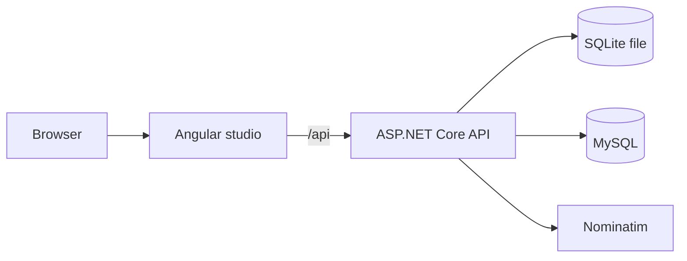

`Database:Provider` chooses the database. The default is `Sqlite`, so `dotnet run` needs no database server. Set it to `MySql` to use Pomelo. Docker Compose sets that for you and starts MySQL 8.4.

## Data model

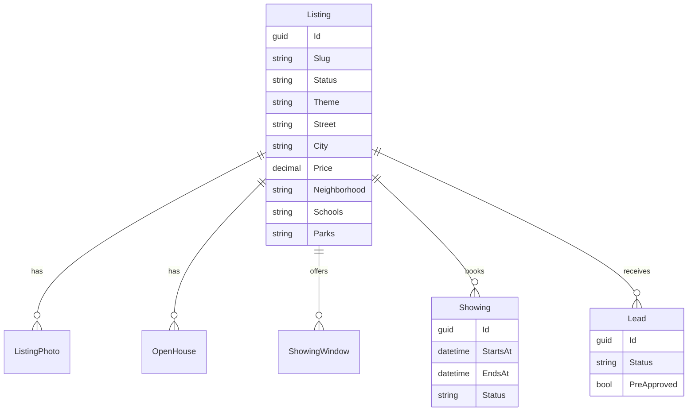

`GeocodeCache` stores Nominatim results by normalized address. Listing status is `draft` or `published`. Lead status is `new`, `contacted`, `showing`, or `offer`. Showing status is `booked` or `cancelled`.

The demo listing uses a fictional address and fictional facts. The photographs are stock images of unrelated rooms with metadata stripped, and no real address appears anywhere. The map shows a soft neighborhood circle (about 600 m across, zoom capped at 14) labelled as a demo, never a pin or a street name, and the public API rounds coordinates to two decimals. School notes are placeholders, since the town is fictional.

## API

| Method | Path | Purpose |
| --- | --- | --- |
| GET | `/api/health` | Process check |
| GET | `/api/listings` | Studio list |
| POST | `/api/listings` | Create a listing |
| GET | `/api/listings/{id}` | Listing for the builder |
| PUT | `/api/listings/{id}` | Update a listing |
| DELETE | `/api/listings/{id}` | Delete a listing |
| GET | `/api/listings/{id}/flyer` | One-page PDF |
| GET | `/api/public/listings/{slug}` | Published page |
| POST | `/api/public/listings/{slug}/views` | Count a view |
| GET | `/api/public/listings/{slug}/slots` | Open showing times |
| POST | `/api/public/listings/{slug}/leads` | Save a lead |
| POST | `/api/public/listings/{slug}/showings` | Book a slot |
| GET | `/api/leads` | Leads for the dashboard |
| PATCH | `/api/leads/{id}` | Change lead status |
| GET | `/api/showings` | Showings for the dashboard |
| PATCH | `/api/showings/{id}` | Cancel a showing |
| GET | `/api/showings/{id}/calendar.ics` | Calendar download |
| GET | `/api/dashboard` | Counts, listings, leads, showings |
| POST | `/api/mortgage` | Payment estimate |
| POST | `/api/uploads` | JPEG, PNG, or WebP upload |

There is no login. This is a local demo.

## Run with Docker

```bash
docker compose up --build
```

Open http://localhost:8080

Compose starts MySQL 8.4 and the API. `Database__ServerVersion` is `AutoDetect`, so Pomelo reads the running server instead of assuming a MySQL 8 version string. The API waits for MySQL, applies migrations, and seeds the demo listing. The local database password in `docker-compose.yml` is `ulric`. It is only for this container. Uploads live in the `ulric-data` volume.

## Run locally with SQLite

This is the zero-config path. No MySQL is required.

API:

```bash
dotnet run --project src/Ulric.Api --urls http://localhost:5080
```

Angular, in another terminal:

```bash
cd src/Ulric.Web
npm ci
npm start
```

Open http://localhost:4200. The Angular app calls `api/...` and `uploads/...` relative to the page base href. With the default base href of `/`, the dev server proxies those requests to port 5080. Demo photographs are served from the Angular `public/media` folder.

The first start creates `src/Ulric.Api/ulric.db`, applies the EF Core migration, and seeds:

- 418 Larkspur Way, Fernhollow, a fictional 1940s bungalow with 18 stock photographs, four leads, an open house and showing windows

An existing database from an earlier build is reconciled on start: the two retired demo listings are removed and the demo listing gets the current photographs and text.

Delete `ulric.db` to seed again. If you still have a database from a build that used `EnsureCreated`, delete that file before starting. Migrations do not alter that older file.

Tests:

```bash
dotnet test Ulric.sln
```

The tests cover mortgage math, showing slot conflicts, and slug generation.

## Deploy under MAMP

This is the layout for Apache at `http://localhost:8888/apps/ulric-listing-studio/` with the API proxied from that same path. MAMP's MySQL in this setup is 5.7.39 on `127.0.0.1` port `8889`.

The Angular app never calls a root-absolute `/api/...` URL. Requests are `api/...`, resolved against `<base href>`. Photo, upload, and calendar links are relative (`media/...`, `uploads/...`, `api/showings/.../calendar.ics`) unless `PublicBaseUrl` is set. Router links already follow the base href.

### Build the studio

```bash
cd src/Ulric.Web
npm ci
npm run build:mamp
```

`build:mamp` runs `ng build --base-href /apps/ulric-listing-studio/`. The trailing slash matters. Copy the files in `dist/ulric-web/browser` into the Apache folder that serves that URL.

The default `npm run build` and the Docker image keep base href `/`. Use `build:mamp` only for this sub-path.

### MySQL 5.7

The example user is `root` and the password is the placeholder `CHANGE_ME`; set your own. Those values live only in `appsettings.Development.example.json` and `.env.example`. Do not put a real password in `appsettings.json`.

1. Start MySQL in MAMP.
2. Create the database with a collation that exists on 5.7:

```sql
CREATE DATABASE ulric CHARACTER SET utf8mb4 COLLATE utf8mb4_general_ci;
```

3. Set `Database__Provider` to `MySql`.
4. Set `ConnectionStrings__MySql` to `Server=127.0.0.1;Port=8889;Database=ulric;User=root;Password=CHANGE_ME;SslMode=None`. `SslMode=None` avoids a TLS handshake that .NET 8 cannot complete against MySQL 5.7. Use it for this local MAMP server only.
5. Leave `Database__ServerVersion` as `AutoDetect`, or set `5.7.39-mysql` if you want to skip detection.
6. Start the API on port 5080. On an empty database it applies the EF Core migration and seeds the demo listing.

SQLite stays the zero-config default. `dotnet run` without these variables still uses `ulric.db`.

The migration uses `utf8mb4` and `utf8mb4_general_ci`. It does not use MySQL 8 collations such as `utf8mb4_0900_ai_ci`. The geocode cache key is `varchar(191)` so its index stays under the 767-byte InnoDB limit on MySQL 5.7. Pomelo detects the server before the DbContext is registered, and retries while MySQL is still starting.

### Apache

Two proxy styles work. Use one of them.

**Static files in Apache, API proxied.** Apache serves the built `index.html` and assets. It forwards only `api` and `uploads` to Kestrel, and the prefix is removed before the request reaches the API. Leave `PathBase` empty. Set `PublicBaseUrl` to `http://localhost:8888/apps/ulric-listing-studio` so Open Graph tags and saved upload URLs use the public origin.

Put the proxy in the MAMP vhost or `httpd.conf`. `ProxyPass` is not valid in `.htaccess`.

```apache
ProxyPass /apps/ulric-listing-studio/api http://127.0.0.1:5080/api
ProxyPassReverse /apps/ulric-listing-studio/api http://127.0.0.1:5080/api
ProxyPass /apps/ulric-listing-studio/uploads http://127.0.0.1:5080/uploads
ProxyPassReverse /apps/ulric-listing-studio/uploads http://127.0.0.1:5080/uploads
```

Put this `.htaccess` in the studio folder so `/p/<slug>` and the other client routes serve `index.html`:

```apache
RewriteEngine On
RewriteBase /apps/ulric-listing-studio/
RewriteRule ^index\.html$ - [L]
RewriteCond %{REQUEST_FILENAME} !-f
RewriteCond %{REQUEST_FILENAME} !-d
RewriteRule . index.html [L]
```

Enable `mod_proxy`, `mod_proxy_http`, and `mod_rewrite`. Allow `.htaccess` overrides for that folder.

**Whole sub-path proxied to Kestrel.** Build with `build:mamp`, copy `dist/ulric-web/browser` into the API `wwwroot`, and proxy `/apps/ulric-listing-studio/` to `http://127.0.0.1:5080/`. If Apache keeps that prefix on the forwarded request, set `PathBase` to `/apps/ulric-listing-studio`. If Apache strips it, leave `PathBase` empty. Set `PublicBaseUrl` either way so Open Graph URLs match the browser.

`.env` is not loaded automatically. Export the variables, or put them in the environment the API process already uses.

## Environment variables

| Name | Purpose | Default |
| --- | --- | --- |
| `Database__Provider` | `Sqlite` or `MySql` | `Sqlite` |
| `Database__ServerVersion` | Pomelo server version when using MySQL. `AutoDetect` reads the server. | `AutoDetect` |
| `ConnectionStrings__Ulric` | SQLite file | `Data Source=ulric.db` |
| `ConnectionStrings__MySql` | MySQL connection string | unset |
| `Storage__Root` | Folder for uploaded images | `App_Data/uploads` |
| `Geocoding__Enabled` | Turn Nominatim on or off | `true` |
| `Geocoding__UserAgent` | User-Agent sent to Nominatim | `UlricListingStudio/1.0 (+https://github.com/erichers/ulric-listing-studio)` |
| `Geocoding__BaseUrl` | Nominatim search host | `https://nominatim.openstreetmap.org` |
| `Geocoding__MinIntervalMs` | Minimum gap between Nominatim calls | `1100` |
| `Notifier__Mode` | Lead notifier. `log` is the only built-in mode. | `log` |
| `Cors__Origins__0` | Browser origin allowed to call the API | `http://localhost:4200` |
| `ASPNETCORE_URLS` | Bind address | `http://localhost:5080` in development, `http://0.0.0.0:8080` in Docker |
| `ASPNETCORE_ENVIRONMENT` | `Development` or `Production` | `Development` |
| `PublicBaseUrl` | Public origin and path for photo, upload, calendar, and Open Graph URLs. Empty keeps those paths relative. | empty |
| `PathBase` | Prefix the API should strip when the proxy keeps it. Empty when Apache strips the prefix. | empty |

## Credits

See [CREDITS.md](CREDITS.md) for every photograph, photographer, source URL, and license.

Map tiles are © OpenStreetMap contributors.
